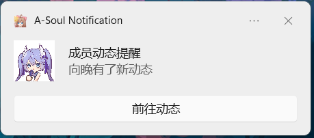

# A-Soul Notification
一个A-Soul成员动态/直播提醒插件，仅能在Windows10-Windows11系统上运行。

使用Qt5编写，核心实现为Request请求+Json库解析+Wintoast消息。

## 功能介绍

### 启动提醒

成功启动后会发出运行中提醒。

### 成员动态提醒

推送成员动态（动态，专栏，视频）。

### 成员直播提醒

推送成员直播消息。

## 工欲善其事，必先利其器

Json库：[nlohmann/json](https://github.com/nlohmann/json)

Wintoast库：[mohabouje/WinToast](https://github.com/mohabouje/WinToast)

Qt自带的JSON库，谁用谁后悔！抓到数据后解析JSON，发现解析结果一直是空的，而且还没有出错，没 有 出 错！DEBUG半天没找出来是啥问题，反复验证返回的数据是否完整，JSON格式是否正确，毫无疑问这俩都没问题。。。最后换了一个接口符合人类直觉、强大好用的JSON库（即nlohmann/json），立马OK。。。再说一遍，Qt自带的JSON库，谁用谁后悔。
